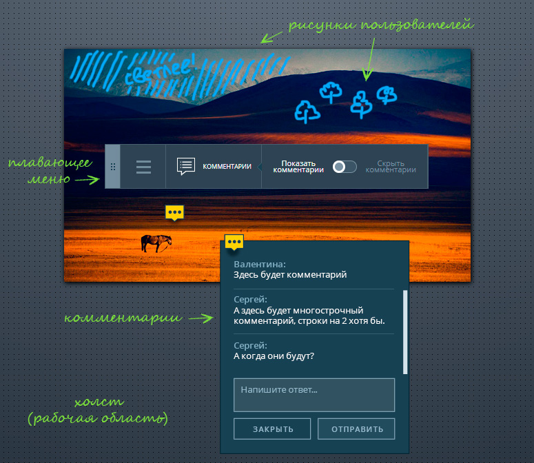
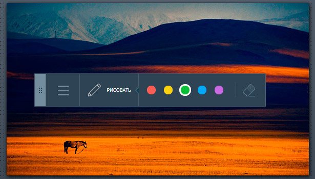
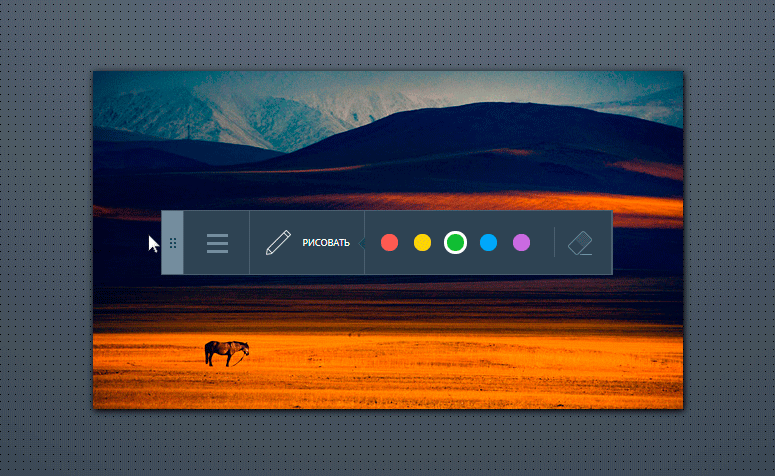
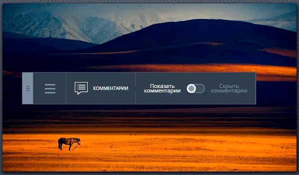

Клиентская часть сервиса для рецензирования изображений онлайн
===

Сервис предоставляет пользователям следующие возможности:
+ загружать изображения;
+ добавлять комментарии к конкретной части изображения;
+ рисовать поверх изображения.

А также сервис наделен элементами совместной работы:
+ загруженное изображение имеет уникальную ссылку, которой можно поделиться;
+ все пользователи, просматривающие изображение, уведомляются о новых комментариях к нему;
+ все пользователи, просматривающие изображение в режиме рисования, видят, что рисуют другие пользователи.

Клиентская часть реализована на JavaScript, использована MVC архитектура, компоненты реализованы с использованием ООП, данные администраторов, тем, вопросов и ответов хранится в СУБД MySQL

+ [ссылка на проект](http://begethost7.beget.tech/draw/)

## Интерфейс



### Публикация

Этот режим открывается по умолчанию при открытии интерфейса: 


В нём доступна всего одна функция: выбор изображения и его публикация на сервере. Изображение можно выбрать двумя способами:

1. Кликнуть на поле «Загрузить новое», после чего откроется стандартный диалог выбора файла. Выбор ограничен только JPG и PNG изображениями.
2. Перетащить файл изображения и бросить на холст. Если брошена не картинка, либо картинка в другом формате (не JPG и PNG), должно появиться сообщение об ошибке:


В обоих случаях, сразу после успешного выбора изображения, оно публикуется на сервере. Если при публикации возникает ошибка, то необходимо сообщить о ней пользователю. При этом у пользователя остаётся возможность попробовать загрузить выбранное изображение повторно, либо выбрать другое изображение.

Пока изображение загружается на сервер, должен отображаться прелоадер:


В случае успеха интерфейс переходит в состояние **Рецензирование**, режим «Поделиться».

После успешной загрузки и отображения изображения на холсте, последующие изображения, брошенные на холст или на имеющееся изображение, должны быть проигнорированы, а пользователю должно быть показано сообщение с рекомендацией воспользоваться опцией «Загрузить новое» в меню:


В это состояние возможно попасть двумя способами:
1. После успешной публикации изображения открывается режим «Поделиться» (_описано в состоянии «Публикация»_).
2. При переходе по ссылке скопированной из режима «Поделиться» открывается режимы «Комментирование» (_будет описан ниже_).

В данном состоянии **Рецензирования** доступно три режима: комментирование, рисование, поделиться. Всегда активен один из этих трёх режимов. Вариант, когда все режимы не активны считается ошибкой.

#### Режим «Комментирование»

Режим открывается при переходе по ссылке полученной в режиме «Поделиться». А так же при клике на пункт «Комментарии» в меню. В этом режиме можно добавлять новые комментарии.

Доступен переключатель, позволяющий показать или скрывать маркеры комментариев.


По умолчанию, маркеры отображаются. И при появлении нового комментария, добавленного другим пользователем, его маркер должен тоже необходимо отобразить. Маркеры отображаются во всех режимах. При клике на каждый маркер открывается окно с комментарием / цепочкой комментариев и формой для отправки нового комментария:


Если в меню выбрать «Скрыть комментарии», то маркеров комментариев не видно:


Это может потребоваться, например, чтобы маркеры не мешали рисовать (_режим «Рисование»_). Маркеры комментариев можно вернуть только выбрав в меню «Показать комментарии». Если комментарии скрыты, то при появлении комментария, который добавил другой пользователь, его маркер не должен появляться. 

При клике в любую точку на холсте, открывается форма добавления нового комментария. Она не должна скрываться при клике на маркер. При добавления нового комментария необходимо показать прелоадер на время, пока данные не будут отправлены:


Одновременно может быть показана только один блок комментариев, либо форма добавления нового комментария. Открытый ранее блок комментария или форма должны скрываться. Форма добавления комментария не должна оставлять маркер при скрытии.

#### Режим «Рисование»



Здесь доступна возможность выбора цвета пера из пяти доступных: 
- красный (`#ea5d56`), 
- жёлтый (`#f3d135`), 
- зелёный (`#6cbe47`), 
- синий (`#53a7f5`) 
- и фиолетовый (`#b36ade`).


Толщина пера постоянна (`4px`). Рисунки отображаются и в других режимах.

#### Режим «Поделиться»


Открывается сразу после публикации. Тут доступна ссылка, перейдя по которой приложение откроется и сразу перейдет в состояние «Рецензироние» именно с этим изображением.

#### Переключение между режимами

Для переключения между режимами пользователю доступно плавающее меню. Меню можно переместить в любую часть холста, если зажать кнопку мыши на «корешке». При перемещении меню не должно выходить за границы экрана:



Раскрыть меню и выбрать другие режимы можно, кликнув на поле «бургер-меню». Переключение осуществляется следующим образом:



При переключении режимов также есть возможность вернуться в состояние **Публикация**.

Меню всегда должно отражать текущее состояние и режим приложения. Если мы в состоянии **Публикация**, то поле «бургер-меню» не отображается, так как доступен только один пункт. Если мы в состоянии **Рецензирование**, то выбран один из режимов, остальные скрыты в поле «бургер-меню».

## Взаимодействие с сервером по HTTP

Для взаимодействии с серверной частью приложения вам доступно REST API по адресу:

https://neto-api.herokuapp.com

### Добавление изображения

`POST /pic` — позволяет опубликовать на сервере новое изображение.

Формат данных при отправке `multipart/form-data`. Поля:

- `title` — название изображения, _строка_
- `image` - изображение, _файл_

В ответ приходит либо сообщение об ошибке, либо JSON-объект с данными о изображении. Например:
```json
{
  "id": "aba23fc0-1008-11e8-b8b2-2b0fbff0de7d",
  "title": "Макет дизайна",
  "url": "https://storage.googleapis.com/neto-api.appspot.com/pic/aba23fc0-1008-11e8-b8b2-2b0fbff0de7d/bMFAlDwf9AI.jpg",
  "timestamp": 1518449006013
}
```

Тут:
- `id` — идентификатор изображения на сервере, _строка_;
- `title` — название изображения, которое передано при создании, _строка_;
- `url` — URL-адрес изображения, по которому оно доступно в сети, _строка_;
- `timestamp` — время публикации изображения, _число_.

### Получение информации об изображении

`GET /pic/${id}` — получить информацию об изображении в JSON-формате. Тут `${id}` — идентификатор изображения на сервере.

В ответ приходит либо сообщение об ошибке, либо JSON-объект с данными об изображении. Например:
```json
{
  "id": "aba23fc0-1008-11e8-b8b2-2b0fbff0de7d",
  "title": "Макет дизайна",
  "url": "https://storage.googleapis.com/neto-api.appspot.com/pic/aba23fc0-1008-11e8-b8b2-2b0fbff0de7d/bMFAlDwf9AI.jpg",
  "mask": "https://www.googleapis.com/download/storage/v1/b/neto-api.appspot.com/o/pic%2F8ece7a20-15f4-11e8-96fd-2513ea9afcae-mask.png?generation=1519100719825524&alt=media",
  "timestamp": 1518449006013,
  "comments": {
    "-L59YakIzQIO4_qiP6ws": {
      "left": 100,
      "message": "Тут мне кажется лучше подойдет розовый цвет",
      "timestamp": 1518448045157,
      "top": 65
    },
    "-L59bM_rv4fesvnQ1nts": {
      "left": 953,
      "message": "Эта картинка на коллаже слишком шумная",
      "timestamp": 1518449031562,
      "top": 480
    }
  },
}
```

Кроме полей, которые были уже описаны при создании изображения, тут может быть доступно еще два необязательных свойства с ключами:
- `mask` — информация о маске изображения, (_строка_, может отстутствовать);
- `comments` — справочник комментариев с уникальными ключами, (_объект_, может отстутствовать).

Свойство `comments`, которое хранит справочник комментариев с уникальными ключами. Каждый комментарий имеет следующие свойства:
- `message` — текст комментария, _строка_.
- `left` — расстояние по горизонтальной оси X от левого края изображения, _число_;
- `top` — расстояние по вертикальной оси Y от верхнего края изображения, _число_;
- `timestamp` — время публикации комментария, _число_.

Ключ является индентификатором комментария.

### Добавление комментария к изображению

`POST /pic/${id}/comments` — позволяет добавить комментарий к изображению с идентификатором `${id}` на сервере.

Формат данных при отправке `application/x-www-form-urlencoded`. Поля:
- `message` — текст комментария, _строка_.
- `left` — расстояние по горизонтальной оси X от левого края изображения, _число_;
- `top` — расстояние по вертикальной оси Y от верхнего края изображения, _число_.

В ответ приходит либо сообщение об ошибке, либо JSON-объект с обновленными данными об изображении (см. _Получение информации об изображении_).

## Взаимодействие с сервером через веб-сокет

Для обновления интерфейса в «реальном» времени дополнительно реализован веб-сокет сервер, принимающий запросы на соединение по адресу:

wss://neto-api.herokuapp.com/pic/${id}

Тут `${id}` это идентификатор изображения. Таким образом, по соединению передаётся только информация, связанная с этим изображением.

Сервер передаёт информацию о возникших событиях в формате JSON. Поэтому для простоты будем называть эту информацию событиями. Общий формат события следующий:
```json
{
  "event": "comment",
  "comment": {
    "id": "-L5lSlx4chCJMqo36iLe",
    "left": 313,
    "message": "Вот тут можно добавить цифру 777",
    "timestamp": 1519100829532,
    "top": 298
  }
}
```

При этом свойство с ключом `event` общее для всех событий. Оно содержит тип события (_строка_, например, `comment`). Остальные свойства полностью зависят от типа события.


